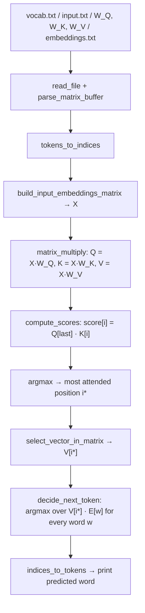

# Mini-Transformer: RISC-V Next-Token Predictor & Custom 16-bit Accelerator

A hardware–software co-design project that implements a **single-layer self-attention next-token predictor** in RISC-V assembly, then designs a **custom 16-bit processor in Logisim** with dedicated dot-product instructions to accelerate the core operation.

Developed for the *Introduction to Computer Architecture* (**IAC**) course at **Instituto Superior Técnico (IST), University of Lisbon**, 2025/2026.


---

## Table of Contents

- [Overview](#overview)
- [Repository Structure](#repository-structure)
- [Requirements](#requirements)
- [Part 1: Vector Routines](#part-1-vector-routines)
- [Part 2: Self-Attention Pipeline](#part-2-self-attention-pipeline)
- [Part 3: Custom 16-bit Processor](#part-3-custom-16-bit-processor)
- [Key Design Decisions](#key-design-decisions)
- [Author](#author)

---

## Overview

Transformers rely on one primitive above all others: the **dot product**. Every projection (Q, K, V), every attention score and every vocabulary lookup reduces to dot products between integer vectors. This project follows that observation across three layers of the computing stack:

| Part | Layer | Deliverable |
| :-- | :-- | :-- |
| **P1** | Software (RISC-V) | Robust vector routines: `dot`, `argmax`, `select` |
| **P2** | Software (RISC-V) | Full next-token prediction pipeline built on P1 |
| **P3** | Hardware (Logisim) | A 16-bit single-cycle CPU with `dot` / `dota` instructions |

Given a short input sentence, the program predicts the next word using a one-layer, single-head attention mechanism over a 30-word vocabulary with 4-dimensional embeddings.

```
Input:  a boy eats
Output: food
```

---

## Repository Structure

```
Mini-Transformer-IAC-Project/
├── P1_skeleton_v1.1/
│   ├── argmax.s              # Index of the largest element
│   ├── dot.s                 # Dot product with overflow detection
│   ├── select.s              # Bounds-checked element access
│   ├── test_assembly.py      # Unit tests (runs RARS)
│   └── rars.jar
├── P2_skeleton/
│   ├── p2-template.s         # Complete attention pipeline
│   ├── vocab.txt             # 30-word vocabulary
│   ├── embeddings.txt        # 30 x 4 embedding matrix
│   ├── W_Q.txt  W_K.txt  W_V.txt   # 4 x 4 projection matrices
│   ├── input.txt             # Input sentence, one word per line
│   ├── expected_outputs_from_inputs.txt
│   └── test_assembly.py      # Unit + integration tests
├── P3/
│   ├── P3_V2.circ            # Logisim-evolution circuit
│   ├── README.md             # ISA and design justification
│   └── NocoesP3.rtf          # Design notes
└── README.md
```

---

## Requirements

| Tool | Purpose |
| :-- | :-- |
| RISC-V assembly
| [Logisim-evolution](https://github.com/logisim-evolution/logisim-evolution) 4.1.0 | Part 3 circuit simulation |

---

## Part 1: Vector Routines

Three foundational routines in RISC-V assembly, each returning a **status code in `a0`** and its result in `a1`.

| Function | Arguments | Result (`a1`) | Description |
| :-- | :-- | :-- | :-- |
| `dot` | `a1` vector A, `a2` vector B, `a3` length | Dot product | Signed overflow detection on both multiplication and accumulation |
| `argmax` | `a1` vector, `a2` length | Index of maximum | Ties resolve to the **smallest index** |
| `select` | `a1` vector, `a2` length, `a3` index | Element value | Rejects negative and out-of-range indices |

### Status codes

| Code | Meaning |
| :-- | :-- |
| `0` | Success |
| `50` | Invalid size (length < 1) |
| `100` | Index out of bounds (`select`) |
| `200` | Arithmetic overflow (`dot`) |

### Overflow detection

- **Multiplication:** `mul` yields the low 32 bits and `mulh` the high 32 bits. The product fits in 32 bits only if the high word equals the sign extension of the low word (`srai low, 31`).
- **Accumulation:** an addition overflows when both operands share a sign and the result has the opposite sign.

---

## Part 2: Self-Attention Pipeline

A complete single-head, single-layer self-attention step, written entirely in RISC-V assembly, including file I/O and text parsing.

### Pipeline



### Algorithm

1. **Load data.** Read the vocabulary, input sentence, three weight matrices and the embedding table from text files via the `open` / `read` / `close` system calls.
2. **Parse.** Convert space-separated signed integers into word-aligned matrices in memory.
3. **Tokenise.** Match each input word against the vocabulary to get its index.
4. **Embed.** Gather the embedding row of each input token into matrix **X** (`n × 4`).
5. **Project.** Compute **Q**, **K** and **V** with `matrix_multiply`.
6. **Score.** Take the query of the **last** token and dot it with every key row.
7. **Attend.** `argmax` over the scores picks the position to attend to; its row in **V** becomes the target vector.
8. **Decide.** Dot the target vector with every vocabulary embedding; the highest score is the predicted token.
9. **Print** the word under a `=== Decision ===` header.

### Functions

| Function | Responsibility |
| :-- | :-- |
| `read_file` | Reads a file into a buffer, returns bytes read |
| `parse_matrix_buffer` | ASCII → integer matrix, returns row count |
| `tokens_to_indices` | Word matching against the vocabulary buffer |
| `build_input_embeddings_matrix` | Row gather from the embedding table |
| `matrix_multiply` | General `(m×n)·(n×p)`, built on `dot` |
| `compute_scores` | Scores of one query row against all key rows |
| `select_vector_in_matrix` | Pointer to a given matrix row |
| `decide_next_token` | Best-matching vocabulary index |
| `indices_to_tokens` | Index → pointer to word in the vocabulary buffer |

All functions follow the RISC-V calling convention: callee-saved registers (`s0`–`s11`) and `ra` are preserved on the stack. `matrix_multiply` builds each column of B on the stack so it can reuse the contiguous-vector `dot` routine from Part 1.

### Static memory limits

| Constant | Value |
| :-- | :-- |
| `CONST_DIMENSION` | 4 |
| `CONST_MAX_VOCAB_TOKENS` | 100 |
| `CONST_MAX_INPUT_TOKENS` | 10 |
| `CONST_BUFFER_SIZE` | 1024 bytes |

### Example

`input.txt` (one word per line):

```
a
boy
eats
```

Program output:

```
=== Decision ===
food
```

Verified test cases:

| Input | Predicted |
| :-- | :-- |
| `a boy eats` | `food` |
| `a girl eats` | `food` |
| `a bird drinks` | `water` |
| `a fish needs` | `water` |
| `a boy needs` | `food` |


---

## Part 3: Custom 16-bit Processor

A single-cycle 16-bit processor in Logisim (`P3/P3_V2.circ`) designed around one goal: executing **2-element dot products in a single clock cycle**.

### Instruction Set

The opcode occupies the **2 least significant bits** of every instruction. With 8 registers (`R0`–`R7`, 3-bit addresses), the remaining bits are spent on operands.

| Instruction | Opcode | Layout (MSB → LSB) | Operation |
| :-- | :-: | :-- | :-- |
| `li rd, imm` | `00` | `imm[11] \| rd[3] \| 00` | `R[rd] ← imm` |
| `add rd, rs1` | `01` | `0[8] \| rs1[3] \| rd[3] \| 01` | `R[rd] ← R[rd] + R[rs1]` |
| `dot rd, rs1` | `10` | `0[8] \| rs1[3] \| rd[3] \| 10` | `R[rd] ← R[rd]·R[rs1] + R[rd+1]·R[rs1+1]` |
| `dota rd, rs1, rs2` | `11` | `0[5] \| rs2[3] \| rs1[3] \| rd[3] \| 11` | `R[rd] ← R[rd] + R[rs1]·R[rs2] + R[rs1+1]·R[rs2+1]` |

Encoding examples:

| Assembly | Binary | Hex |
| :-- | :-- | :-- |
| `li R1, 5` | `00000000101 001 00` | `0x00A4` |
| `add R2, R1` | `00000000 001 010 01` | `0x0029` |
| `dot R0, R2` | `00000000 010 000 10` | `0x0042` |
| `dota R0, R1, R3` | `00000 011 001 000 11` | `0x0323` |

Vectors are stored in **consecutive registers**: a vector named by `R[n]` is the pair `(R[n], R[n+1])`.

### Datapath

- **Register file:** 8 × 16-bit registers, **4 independent read ports**, 1 write port (driven by a 3→8 demultiplexer enabling the target register). Ports 3 and 4 read `Read Register 1 + 1` and `Read Register 2 + 1`, computed by two small 3-bit adders, so both vector components are available in the same cycle.
- **Address multiplexers:** two 2:1 multiplexers choose between `rd / rs1` and `rs1 / rs2` for the read addresses, depending on whether the instruction is `dota`.
- **ALU:** four blocks compute in parallel and a final 4:1 multiplexer selects the result:

| `SinalALU` | Instruction | Block |
| :-: | :-- | :-- |
| `00` | `li` | Immediate pass-through (sign-extended 11 → 16 bits) |
| `01` | `add` | 16-bit adder |
| `10` | `dot` | Two 16-bit multipliers + adder |
| `11` | `dota` | Dot-product block + accumulator bypass of `R[rd]` |

- **Control unit:** deliberately minimal. `SinalALU` is the opcode itself, `RegWrite` is always `1`, and the address-select signal is `1` only when the opcode is `11` (`dota`).
- **Fetch:** a 16-bit program counter, an adder that increments it, and a ROM holding the program.

### Simulating

1. Open `P3/P3_V2.circ` in Logisim-evolution 4.1.0.
2. Load a program (16-bit words) into the instruction ROM.
3. Enable the clock (`Simulate → Auto-Tick Enabled`) or step manually and observe the register file.

### Why this design

- **Maximum operand space.** A 2-bit opcode caps the ISA at four instructions, but removes `func3`/`func7` decoding entirely. That frees 11 bits for the `li` immediate and lets `dota` carry three register operands in one instruction.
- **Few components.** 3-bit addresses keep the register file at eight registers; the multi-port read costs only two extra 3-bit adders.
- **Room to grow.** `add`, `dot` and `dota` leave 8, 8 and 5 unused bits respectively, which can later act as a secondary selector (similar to `func3`) for new operations without leaving 16 bits.

---


## Key Design Decisions

- **Reuse over duplication.** `matrix_multiply`, `compute_scores` and `decide_next_token` are all thin loops over the same `dot` routine, mirroring how the hardware in Part 3 accelerates that one primitive.
- **Explicit error contracts.** Every routine returns a status code, so failures (bad sizes, overflow, out-of-range indices) are detectable instead of silently corrupting results.
- **Hardware shaped by the workload.** The ISA, register-file ports and ALU in Part 3 exist because of the dot-product-heavy structure discovered in Part 2.

---

## Author


**Cristiano Suranyi** — [GitHub](https://github.com/Cristiano-Suranyi) · [LinkedIn](https://www.linkedin.com/in/Cristiano-Suranyi)

*Computer Science and Engineering student at Instituto Superior Técnico.*

---

*Academic project. If you are currently enrolled in this course, please respect your institution's academic integrity policy.*
